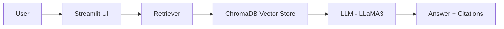

🧠 MULTI-DOC-RAG — AI-Powered Document Intelligence System

🚀 Live Demo
https://multi-doc-rag-jhv5c83ip6bf7tkmipvepv.streamlit.app/

📌 Project Overview

MULTI-DOC-RAG is an AI-powered Retrieval-Augmented Generation (RAG) system that allows users to upload multiple documents and interact with them using natural language queries.

It intelligently retrieves relevant context from documents and generates accurate, grounded responses using LLMs.

This project demonstrates real-world implementation of:

Document understanding systems
Semantic search using embeddings
LLM-based reasoning (Groq / LLaMA3)
Scalable vector databases

✨ Key Features
📂 Upload multiple documents (PDF, DOCX, TXT, MD)
🧠 Context-aware Q&A using RAG pipeline
🔎 Source attribution (trace answers back to documents)
💬 Chat-style conversational interface
⚡ Fast inference using Groq API
🗂 Persistent vector storage using ChromaDB
🎯 Multi-document semantic search

🏗️ System Architecture


🧰 Tech Stack
🧠 AI / ML
LangChain
Groq API (LLaMA3)
HuggingFace Embeddings
ChromaDB (Vector Store)

🌐 Backend / UI
Python 3.10+
Streamlit

☁️ Deployment
AWS EC2 (Ubuntu)
GitHub


## 📁 Project Structure

```text
MULTI-DOC-RAG/
│
├── app.py                 # Streamlit frontend (UI)
├── rag_engine.py          # Core RAG pipeline (retrieval + LLM logic)
├── utils.py               # Helper functions (file handling, formatting)
├── requirements.txt       # Python dependencies
├── .env                   # API keys (NOT pushed to GitHub)
│
├── chroma_store/          # Persistent vector database (ignored in git)
└── README.md              # Project documentation
```

⚙️ How It Works
User uploads documents
Documents are loaded & chunked
Embeddings are generated
Stored in ChromaDB
User asks a question
Retriever fetches relevant chunks
LLM generates grounded response
Sources are displayed for transparency


💻 Run Locally

1️⃣ Clone Repository
git clone https://github.com/your-username/MULTI-DOC-RAG.git
cd MULTI-DOC-RAG
2️⃣ Create Virtual Environment
python -m venv venv
source venv/bin/activate   # Mac/Linux
venv\Scripts\activate      # Windows
3️⃣ Install Dependencies
pip install -r requirements.txt
4️⃣ Setup Environment Variables

Create .env file:

GROQ_API_KEY=your_api_key_here
5️⃣ Run Application
streamlit run app.py
